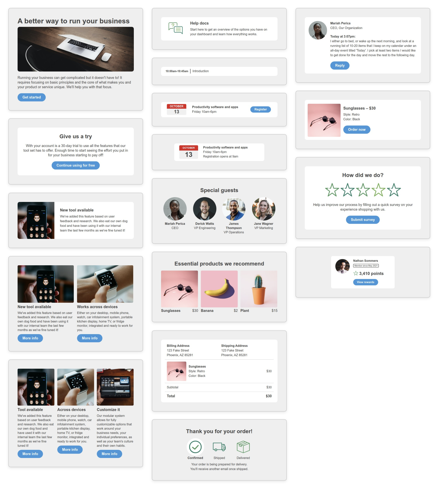
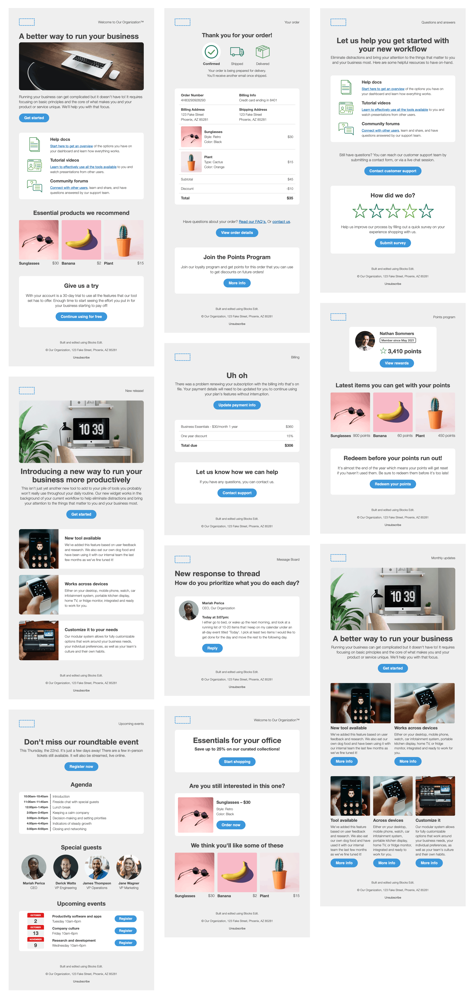

# Starter Email Components
### HTML design system of accessible and responsive email templates to use for your emails

Modularly designed email components that work across email clients, with example template layouts to get started with.

## Features ##
- 15 commonly used design patterns
- 10 template layouts, including: newsletters, on-boarding emails, announcements, events, products, orders, and notifications
- Stackable and standalone elements
- Responsive across screen sizes
- Dark mode compatibility
- Semantic code, optimized for accessibility
- Blocks Edit ready for drag and drop editing

## Email clients tested ##
- Gmail (and Android)
- Apple Mail
- Microsoft Outlook (and Windows)
- Yahoo! Mail (and AOL)

## Components included ##

## Template layouts included ##

Real-world examples of each email type:
- [Welcome/onboarding](https://blocksedit.com/starter/welcome/) - sent when your audience signs up for your service, with relevant info and what to expect from you
- [Announcements](https://blocksedit.com/starter/announcement/) - share and promote something new or updated with your business, product, or service
- [Events](https://blocksedit.com/starter/event/) - educate your audience on your event’s value and why it’s worth investing their time in it
- [Confirmation emails](https://blocksedit.com/starter/confirmation/) - when something has happened, like during the purchase process
- [Subscription and payment](https://blocksedit.com/starter/subscription-payment/) - important account subscription info and payment-related notices
- [Notifications](https://blocksedit.com/starter/notification/) - activity related to product or service
- [Promo and e-commerce](https://blocksedit.com/starter/promo-ecommerce/) - product offerings and recommendations
- [Helpful emails](https://blocksedit.com/starter/helpful/) - instructions, support info, and feedback requests
- [Engagement emails](https://blocksedit.com/starter/engagement/) - content based on customer’s previous actions
- [Newsletter](https://blocksedit.com/starter/newsletter/) - news and updates for a topic, or your product or service, or both